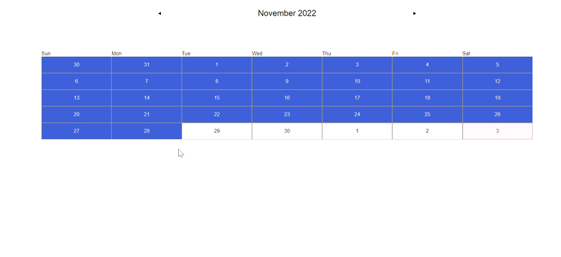

# Final project design



## Optimization

* Migrate and restructure redux code into using Redux toolkit
* Add an edit button so that users can edit reminders
* Allow users to create reminders in year 2023
* Make UI look more appealing.
* Fix bug that doesn't allow users to save their reminders after switching months.
* Clean up the universally unique identifier file 


## Component Hierarchy

```
<Calendar>
  <CalendarNavContainer>
    <CalendarNav/>
  </CalendarNavContainer>
  <CalendarHeader/>
  <CalendarMonthContainer>
    <CalendarMonth>
      <ReminderItem>
        <ReminderLabel/>
        <ReminderForm/>
      </ReminderItem>      
    </CalendarMonth>
  </CalendarMonthContainer>
</Calendar>

```

### Actions

Let's recall that an action in Redux is a single, granular, specific piece of information that changes the app's state. Actions are made up of JavaScript Objects that always have a type.

In src/actions/index.js we can see the amount of actions we have.

```
export const prevMonth = () => ({
  type: types.CALENDAR_PREV_MONTH
})

export const nextMonth = () => ({
  type: types.CALENDAR_NEXT_MONTH
})

export const addReminder = (weekIndex, weekdayIndex) => ({
  type: types.ADD_REMINDER,
  payload: { weekIndex, weekdayIndex }
})

export const editReminder = (weekIndex, weekdayIndex, reminder) => ({
  type: types.EDIT_REMINDER,
  payload: { weekIndex, weekdayIndex, reminder }
})

export const deleteReminder = (weekIndex, weekdayIndex, reminder) => ({
  type: types.DELETE_REMINDER,
  payload: { weekIndex, weekdayIndex, reminder }
})
```
Our actions take the necessary information to create an event. That event should be returned and dispatched into the store.

### Reducers
Remember that a reducer is a pure function. It takes in the current state and an action. Then returns an updated state.

```
function calendarReducer (state = initialState, action) {
  switch (action.type) {
    case 'CALENDAR_PREV_MONTH': {
      ...
    }
    case 'CALENDAR_NEXT_MONTH': {
     ...
    }
    case 'ADD_REMINDER': {
      ...
    }
    case 'DELETE_REMINDER': {
      ...
    }
    default:
      return state
  }
}

```

If the reducer cares about the action then it makes a copy of the state and updates it. Otherwise return the existing state unchanged.
